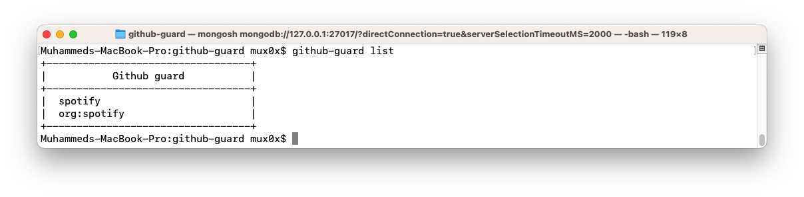
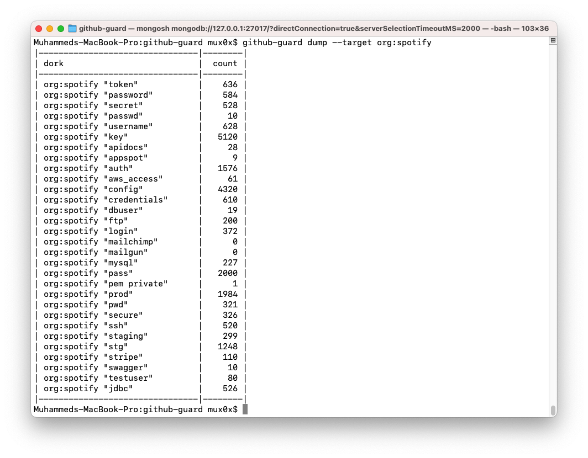

# github-guard 🛡️

`github-guard` is a tool for searching Github for sensitive information leaks. It was forked from [gitdorks_go](https://github.com/damit5/gitdorks_go) and enhanced to provide more features.


## Features

- Search Github for leaks using dorks.
- Store results in a MongoDB database and check periodically for new records.
- Send notifications to Discord or Telegram when new leaks are found.
- Support multiple modes of operation:
    - `h4ck`: searches for leaks in Github.
    - `dump`: dumps all dorks results for a specific org / target - requires target.
    - `list`: lists all targets in the database.

## Installation

First you have to install `mongoDB` , and run it for sure

For MongoDB installation instructions [check this out](https://www.mongodb.com/docs/manual/administration/install-community/)

To check if MongoDB is running on macOS or Ubuntu, you can use the following commands in the terminal:

For macOS:

1. Open the terminal
2. Type `brew services list` and hit enter
3. Look for the service named `mongodb-community`
4. If it has `started` next to it, then MongoDB is running
5. If it has `stopped` next to it, then MongoDB is not running
6. To start MongoDB, type `brew services start mongodb-community` in the terminal

For Ubuntu:

1. Open the terminal
2. Type `systemctl status mongodb` and hit enter
3. If MongoDB is running, you will see `Active: active (running)` in the output
4. If MongoDB is not running, you will see `Active: inactive (dead)` in the output
5. To start MongoDB, type `sudo systemctl start mongodb` in the terminal

Note: If you have installed MongoDB using a different method or version, the above commands might not work.

To install `github-guard`, run:

```
go install -v github.com/mux0x/github-guard@lates
```

Make sure you have Go installed on your machine.

## Usage

```
github-guard <mode> [flags]
```

The available modes are:

- `h4ck`: searches for leaks in Github.
- `dump`: dumps all dorks results for a specific org / target - requires target.
- `list`: lists all targets in the database.

The available flags are:

- `--gd`: Github dorks file path.
- `—-gk`: Github search keyword.
- `—-token`: Github personal access token.
- `—-tf`: Github personal access token file.
- `—-target`: Target which search in Github.
- `—-tl`: List of targets to search for leaks.
- `—-nw`: If get Github API rate limited, need to wait? (true or false)
- `—-nws`: How many seconds to wait each time.
- `—-ew`: How many seconds does each request should wait?
- `—-auto`: Scan a target every n hours [provide number of hours].
- `—-webhook`: Discord webhook URL.
- `—-telegram-token`: Telegram bot token.
- `—-telegram-chat-id`: Telegram chat ID.

Example commands:

```
github-guard list
```

```
github-guard h4ck --target org:spotify --token ghp_xxxxxxxx
```

```
github-guard dump --target org:spotify
```

Make sure to replace `ghp_xxxxxxxx` with your Github personal access token.

## Acknowledgements

- The [gitdorks_go](https://github.com/damit5/gitdorks_go) project, which inspired this tool.
- The [MongoDB Go driver](https://github.com/mongodb/mongo-go-driver) and the [Telegram Bot API](https://core.telegram.org/bots/api) for providing easy-to-use libraries.

## Contributions

Contributions are welcome! If you want to contribute to this project, please fork the repository and submit a pull request.
